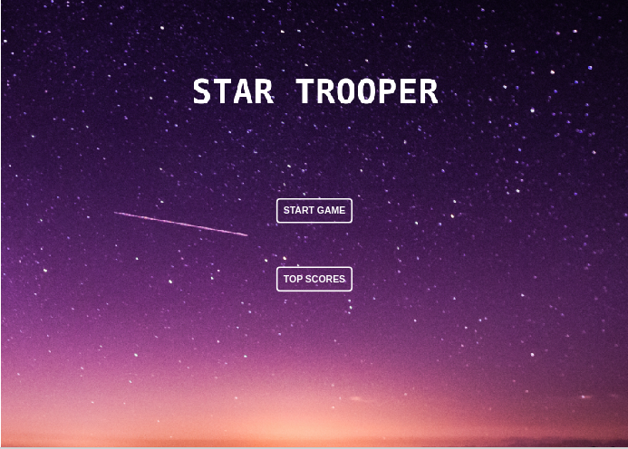
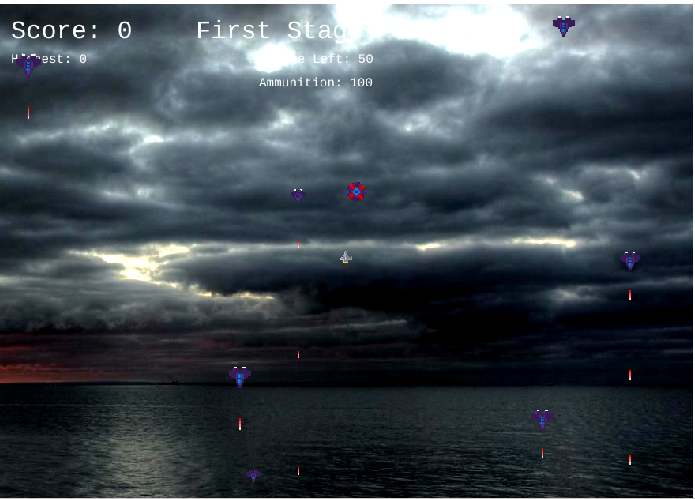

## Sky Shooter!

The goal of this project is to create a Javascript Shooter Game using Phaser 3, as specified in the Microverse Program.
The "Sky Shooter Game" is a JavaScript-based implementation of a Phaser 3 game. It's a game for one person only. To win points and bullets, the player must shoot adversaries in the sky. The game ends when a player is shot by an enemy or when his or her bullets run out. The Leaderboard shows each player's score.



## Live Demo

[Live Demo Link](https://skyshooter.herokuapp.com/)

## Game Concept

> Sky Shooter is the first game I've ever designed. When I was little, I got my inspiration from a simple Star Wars game that I used to watch my buddies play. I had no idea that one day I would be able to create my own game!

## Main Objective

> To earn additional points and ammunition, you must shoot enemies. 
> A point is awarded to you when you defeat an enemy. 
> You can use the keyboard "Spacebar" to shoot down adversaries as a player. 
> Beat the high scores of other players! The score of a player is saved locally in the browser and compared against prior results.
> If a player's score exceeds the previous score, they are promoted to the top of the LeadersBoard.



## Game Design
### Game Mechanics
1. Shoot enemies to get points
2. Beat your previous highest score
3. Send you score to an online LeaderBoard

### Targeted Platforms
> To be played on a Web Browser only
### Project Scope
- To gather development resources
- Does not incur any monetary cost
- Should take approximately 5 -6 days from development to launch
- Phaser 3 Developer License
- To be deployed on Heroku platform
### Assets needed
- Player ship
- Enemies ships
- Expeditionary ships
- Laser beams
- Backgrounds

#### Sounds
- Laser beams
- Imapact sound
- Shoot sound
- Explosion
- Button clicks
- Play button sound

#### Code
1. Phaser 3 game engine
2. Webpack
3. Html template page
4. Jest testing platform
5. JS Modules
## Game instructions:

> Here you can find all the Game Instructions:
- MOVE UP: Press [W] key
- MOVE DOWN: Press [S] key
- MOVE LEFT: Press [A] key
- MOVE RIGHT: Press [D] key
- SHOOT LASER: Press [SPACEBAR] key

## Prerequisites
- NPM package and JavaScript knowledge.

## Getting Started

To get a local copy up and running follow these simple example steps.

```
git clone https://github.com/happiguru/Game-JavaScript
npm install
npm run start
Open http://localhost:8000/ on your browser.
```
## Testing

- You can run tests by running 'npm test'

## Built With

- Javascript
- HTML
- Phaser 3
- Webpack
- Node.js
- Babel
- Leaderboard API
- JEST testing
- Heroku
- ESlint and Stylelint as linters

## Author


👤 **Stanley Enow Lekunze**

- Github: [@happiguru](https://github.com/happiguru)
- Twitter: [@Lekunze_Nley](https://twitter.com/Lekunze_Nley)
- Linkedin: [lekunze-nley](https://www.linkedin.com/in/lekunze-nley/)

## 🤝 Contributing

Contributions, issues and feature requests are welcome!

## 🤝 Acknowledgments

Special thanks for the help during this project to: 

- Emmanuel

## Show your support

Give a ⭐️ if you like this project!

## 📝 License

This project is [MIT](https://github.com/happiguru/Game-JavaScript/blob/4bf5acfdd1b9df7bdc841b1665f9864a6dd6b88d/LICENSE) licensed.
